```{r setup, include=FALSE}
knitr::opts_chunk$set(echo = TRUE)

set.seed(1)
```

## 1. Introduction

This multi-class classification task was to categorise songs into one of four genres (rock, pop, hip hop and rap) based on their audio and lyrical features. Using EDA to learn how these features vary by genre and research into multi-class classification models, we chose to explore what we expected to be the best performing model architectures: Random Forest, XGBoost and Neural Networks. Our development process, detailed below, was a cycle of EDA, feature engineering and model experimentation motivated by model performance. Ultimately, as anticipated, our XGBoost models produced the most accurate predictions, although model refinements seemed not to improve this score beyond a point, we propose due to the inherent difficulty of distinguishing genres.

_Please note the EDA and XGBoost were conducted in Python so check Jupyter notebook for details._

## 2. Exploratory Data Analysis

### 2.1 Descriptive Statistics

The training data is made from 10k songs with 12 audio and 1221 lyric features, roughly balanced by genre. After normalising the audio features (see Table 1) we can see that the overall variation is pretty low (particularly audio_duration_ms), and based on centrality measures (see Table 2) & distribution plots (see Figures 1 & 2) the values are largely symmetrically distributed (although instrumentalness appears incredibly right skewed and more songs are major than minor). Moreover, there are many outliers in the audio and lyric features (see Figure 3), which is known to impact performance of XGBoost. Focusing on the lyric features, which drive the high dimensionality of the data, we can see that most words have fewer than 500 mentions, and 80% of all the words mentioned are made up of only 49% of the words (see Figures 4 & 5). This is partly driven by some words being mentioned consistently across songs (e.g. ‘girl’), or repeated many times within specific songs (e.g. ‘uh’ which is repeated 138 times in one hip hop song). Dimensionality reduction and scaling techniques are used to address the impact of distribution of lyrics data.


### 2.2 Analysis

Although correlation is not an issue for XGBoost & Random Forest models, we found minimal correlation between audio features (see Figure 6) (with the exception of energy, which was somewhat correlated with acousticness and loudness). There was some strong correlation between lyric features for Spanish words (see Figure 7), which is unsurprising as Spanish words are unlikely to be mentioned in isolation. Spanish words were disproportionately mentioned in rap and hip hop songs, as can be seen when looking at the top lyric features by genre (see Table 3, Figure 8). This analysis also revealed to us the similarities between genres: pop & rock share 4 of the top five most mentioned words and rap & hip hop share 2. When conducting ANOVA to find the audio features that most distinguish genres, we can see that all are significant at 5% level (see Table 4), however even the most significant features (danceability and speechiness) seem to split the genres only into two as above - with especially little difference between rap & hip hop (see Figure 9 & 10). As a result of this observation, we attempt to create features later on to help our model differentiate between rap and hip hop. 

Exploring this similarity further, we found that there were ~1000 songs that were identical across all features to a song in another genre, with 646 of those being either rap or hip hop. We anticipated that this could be for two reasons: Firstly, these genres are in reality very similar, and so the genre distinction itself is somewhat arbitrary. Secondly, the data was taken from Spotify genre-centred playlists and it is possible that the same songs appeared in both playlists. We attempted to account for this in model training by filtering out songs that had identical counterparts in other genres.

## 3. Feature Selection

### 3.1 Lasso Model

We trained a LASSO model for both prediction and feature selection. Feature selection was our priority, as we expected that the LASSO model would underperform relative to ensemble tree-based algorithms due to the correlation between feature variables and the non-linearity of the relationships between features and outcomes. 

We discovered that the value of lambda that minimised CV MSE 1 standard error away from the minimum was 0.00487 (Figure 11). We chose lambda 1 standard error away from the true minimum to avoid overfitting our model to the test data.

Considering the high dimensionality of the dataset, we experimented with using TF-IDF for feature selection alongside the LASSO regularisation. However, we found that the TF-IDF scores are not positively skewed as we expected but had a negative binomial distribution instead (see Figure 12). We hypothesise that the scores were not helpful because they should have been grouped by genre and song, due to the multi-class classification nature of the task and, thus, chose LASSO as our main feature selection method.

For this same multi-class reason, we create a LASSO coefficient per feature for each class. We keep a feature if at least one of the classes has a non-zero coefficient for said feature. We felt that in the case of a coefficient being non-zero for at least one class, this feature could be informative in our predictions due to its potential relative predictive power. After using lambda-2 and only removing coefficients that were 0 for all four classes, we removed 519 features from our original 1233 - leaving us with 714 features at this stage. 

### 3.2 Feature Engineering

By identifying and extracting informative features from the data, feature engineering enables machine learning algorithms to better understand the underlying patterns and relationships in the data. Our hope in this process is that certain genres activate our features at different rates which, in turn, can lead to more accurate and reliable classifications. 

Our feature creation was driven by both our EDA and our domain expertise concerning music and themes. We focus our feature engineering efforts on creating features that identify linguistic differences and also some which aim to provide some substantive meaning. Our hope was to use feature selection to aid the model in instances where it was misclassifying genres (most commonly between hip hop and rap). We use the lyrics variables to develop our six binary variables (all of which are named what they are an indicator of): `Spanish`, `AAVE` (the African-American Vernacular English), `Non-Word`, `Swear_word`, `Druf_ref` and `Structure` (an indicator of whether the lyric is perhaps an indicator of part of the song structure like ‘chorus’). 

Even with these features, our model struggled to differentiate between rap and hip hop. As a result, we summed all features for rap and hip hop songs (individually) and looked for features that had the highest absolute value difference between the two when using our scaled dataset. We allocated the top 50 features with the highest differences to `likely_rap` and `likely_hh` accordingly.

## 4. Model Development

For this challenge we prioritised predictive power over interpretability. We explored three model architectures: Neural Nets, Random Forest, and Boosting models. We expected our boosting models to perform the best as boosting models are known for their ability to produce highly accurate predictions by combining many weak learners to form a strong predictor. Furthermore, boosting models are not as prone to overfitting as Random Forest / bagging models. We also expected Neural Nets to perform quite well due to the high dimensionality of the data. 

After using the baseline LASSO model, we did not explore any other linear based models. Since our features were a combination of audio and lyrics, we did not expect them to have a linear relationship with each genre. As a result, existing theory guided us to focus on tree-based approaches. (James 2021).

### 4.1 Neural Network

Neural networks have been shown to perform well in multi-class classification tasks and so we experimented with them during the feature selection process. Using dimensionality reduction based on LASSO analysis improved accuracy from 50% to 65% 5-fold CV accuracy score with random search-optimised hyperparameters. This is perhaps due to the negative impact of correlated features on neural networks (which adds variance to the model) which regularisation reduces. We used automatic tuning to avoid issues of hyper-dimensionality associated with grid search. However, we decided to tweak the maximum number of iterations to from 100 to 200 and also to increase maximum weights to 12,500 to allow for flexibility in response to the high-dimensionality of the data. The submission performed well with a test F1 of 62% but is pale in comparison to the subsequent models. We hypothesised that could be due to overfitting on the data, which would be a sign that the hyperparameters needed further tuning, or the model may have better suited training on larger data sets. We would expect a jump in performance as our training set increased, due to neural networks’ demonstrated ability to make highly accurate predictions with massive amounts of data

### 4.2 Random Forests

We chose to test random forests due to their ability to perform well in non-linear scenarios and classify in high-dimensional space whilst offering robustness to correlated features. In total, we trained 6 random forests. The first was used for both prediction and feature selection whilst the second and third were optimally tuned for prediction. The remaining three models were utilised for testing the model to adjustments in the feature engineered process. In all iterations of our random forest, we chose to fix the number of trees being trained to 500. As well as being the default setting, this is due to the body of work, such as that of Genuer, Poggi, & Taleau (2008) that demonstrates a drop-off in performance improvements past this number across a variety of different applications. As a result, we were left to optimise the number of variables randomly selected per tree (mtry) to optimise for each model via cross-validation. 

We trained our first model using random search without feature selection or engineering. We used the mean decrease in gini-score upon variable removal for our variable importance metrics, these metrics (Figure 13) contributed to our feature engineering as we categorised these into variables using our musical domain expertise. Random search on the first model optimized mtry at 71, we then used a grid search on the second model (15 to 75), which optimized at 71 again. We identified one feature that had a variable importance score of 0, ‘lyrics_course,’ which we promptly removed. We decided against removing any further features using the variable importance score under the assumption that any boosting or forest model  had the necessary algorithmic robustness to not be negatively affected by these additional variables. Finally, we chose to optimise a third model using a gridsearch around the optimum mtry value from our previous model.

Our third model expanded the number of CV-folds to 8 in order to reduce variance in estimating test error with CV error. We continued to retrain the model as we created features. Our iterative approach during the random forest training is reflective of our embedded approach for model and feature selection, and demonstrates the utility of consistently combining data management with modelling choices. Interestingly, despite leading to our highest CV Accuracy score, shown in Figure 14, this final random forest failed to outperform our XGBoost models out-of-sample. **We believe this is because the XGBoost models are less prone to overfitting due to the shallowness of the trees that are created, in contrast to random forests which grow full trees and thus might use variables to fit that are more powerful predictors in our training set than out-of-sample.**

### 4.3 XGBoost

We chose XGBoost based on its dominance in Kaggle competitions with multi-class classification tasks. It can be customised in a number of respects, including regularisation which is key in this task as the data we are using has high dimensionality. It works as other boosting algorithms do, growing decision trees in sequence (rather than randomly like RF models). Instead of sampling randomly, it uses information from previously grown trees to weight samples based on how well they were classified. In this way it should provide a solution faster than standard boosting approaches, which take random samples. 

We took two approaches to model development with XGBoost - multi-class classification, and ensemble modelling with binary logistic regression. For each model, we optimised a subset of hyperparameters (including alpha and gamma for regularisation) that impact model complexity and robustness based on random search (See Figure 15).

_Multi-Class Classification_
 
XGB1 | Baseline submission with hyperparameters chosen based on research.

XGB3 | This model refined XGB1 with hyperparameter optimisation, producing the strongest F1 score on the test data (at the time of submission).

XGB4 | Based on EDA, we filtered songs with outlier values in numerical audio features and rescaled the lyric features to replace counts above 50 with 50. Although the training F1 score appeared to be better with this approach, the model didn’t improve on XGB3, perhaps because outlier removal caused imbalanced training data or the hyperparameters were optimised for XGB3.

XGB6 | Building from XGB4, to address the imbalanced training data, we used SMOTE resampling to balance classes. We also added the engineered features described above. Again, surprisingly the model did not outperform XGB3.

XGB7 | Building from XGB6, and reflecting on the repeated failure in distinguishing rap and hip hop (see Fig 11 for an example), we returned to EDA and found duplicated songs as described above. For this model we filtered the duplicates across genres but again, didn’t outperform perhaps as the duplicates were disproportionately either rap or hip hop, so some information on these genres may have been lost.

_Ensembles of XGBoost Models_

XGB2 | To address the confused classification of rap & hip hop, we created an ensemble of binary XGBoost models (one vs rest for each genre) in the hope of creating models well-tuned to identifying those specific genres. The classification was aligned with whichever model outputted the highest probability for the song belonging to its genre. This model did not perform well, perhaps because the models were trained on unbalanced data and so were biased to overpredict genre non-membership.

XGB5 | Based on the natural pairs in the genres found in EDA, we attempted a two-round classification approach: first, hip hop/rap vs pop/rock, then based on predicted pair, hip hop or rap and pop or rock. Unfortunately, the combined model performed poorly as although the hip hop vs rap error was less than in mulitclass, its error compounded with the error in splitting the genres was higher.


## 5. Evaluation and Reflection

As we had anticipated, an XGBoost model dominated (XGB3) in predictions on the test set, with an F1 score of 0.67887 (see Figure 16 or Model Summary Excel in GitHub for full model results). It had a learning rate of 0.22 which was higher compared to other models trained, and a min child weight which was lower (1 vs 15 on average), which suggests that this model split more often and made greater convergence steps than the others. In future models we may consider experimenting further with these differentiating parameters. Moreover, based on analysis of feature importance using permutation, the highest mean accuracy decrease for this model came from audio features speechiness, danceability and loudness (see Figure 12). This aligns with ANOVA conducted as part of EDA, although it was shown that these features distinguish the ‘pairs’ of genres well, but not the individual genres within those pairs.

In our attempt, feature creation did not improve the models substantially, however with more time, we would look to try other methods, and research ways of amplifying existing features that best separate the genres within each pair (e.g. tempo for rap vs hip hop). Improved features and data curation potentially could have improved the predictions of our XGBoost and RandomForest models, which seemed to improve only up to a point with tuning. 

## 6. Conclusion

Aside from the improvement points mentioned above, we also acknowledge that any model would be limited by the inherent difficulty of the task at hand: we perhaps cannot expect a machine to learn to differentiate genres that we as humans struggle to differentiate ourselves (as is demonstrated by the number of duplicate songs found across genres). Therefore in future model development we may choose a different classification task such as multi-label classification - which could better represent songs that could belong to multiple genres.

## 7. Bibliography

Genuer, R., Poggi, J., Tableau, C. “Random Forests: some methodological insights,” arXiv, pp 1-35, 2008, arXiv:0811.3619

James, Gareth, et al. “Chapter 8: Tree-Based Methods.” An Introduction to Statistical Learning: With Applications in R, Springer, New York, NY, 2021. 

\newpage

## 8. Appendix

```{=tex}
\begin{table}[h]
  \centering
  \caption{Descriptive Statistics - Normalised Variance of Numeric Audio Features}
  \label{tab-audio-features}
  \begin{tabular}{ |l|c| } 
   \hline
   Audio Feature           & Normalised Variance \\
   \hline
   audio\_duration\_ms        & 0.002705           \\
   audio\_loudness           & 0.013458           \\
   audio\_instrumentalness   & 0.016549           \\
   audio\_speechiness        & 0.019081           \\
   audio\_liveness           & 0.024587           \\
   audio\_energy             & 0.028837           \\
   audio\_danceability       & 0.033149           \\
   audio\_tempo              & 0.035869           \\
   audio\_acousticness       & 0.041389           \\
   audio\_valence            & 0.054598           \\
   \hline
  \end{tabular}
\end{table}
```
```{=tex}
\begin{table}[h]
  \centering
  \caption{Descriptive Statistics - Summary Table for Audio Features}
  \label{tab-audio-summary}
  \begin{tabular}{ |l|c|c|c|c| } 
   \hline
   Audio Feature         & min       & 50\%      & mean      & max        \\
   \hline
   audio\_loudness        & -24.149   & -6.160    & -6.676959 & 0.221      \\
   audio\_speechiness     & 0.022300  & 0.079200  & 0.140995  & 0.943      \\
   audio\_danceability    & 0.112000  & 0.660000  & 0.647790  & 0.981      \\
   audio\_instrumentalness& 0.000000  & 0.000001  & 0.031413  & 0.981      \\
   audio\_valence         & 0.030500  & 0.547000  & 0.539495  & 0.985      \\
   audio\_liveness        & 0.016700  & 0.135000  & 0.196531  & 0.986      \\
   audio\_acousticness    & 0.000003  & 0.068700  & 0.156232  & 0.991      \\
   audio\_energy          & 0.003570  & 0.714000  & 0.699362  & 0.999      \\
   audio\_mode            & 0.000000  & 1.000000  & 0.603700  & 1.000      \\
   audio\_key             & 0.000000  & 6.000000  & 5.322100  & 11.000     \\
   audio\_tempo           & 60.019000 & 120.054500& 121.274664& 213.788    \\
   audio\_duration\_ms     & 25987.000 & 223580.000& 231864.495900 & 1207970.000 \\
   \hline
  \end{tabular}
\end{table}
```
```{=tex}
\begin{table}[h]
  \centering
  \caption{Top Lyrics by frequency of mention by Genre}
  \label{tab-lyrics-by-genre}
  \begin{tabular}{ |l|l| } 
   \hline
   Genre      & Top Lyrics                   \\
   \hline
   hip hop    & yo, ya, uh, money, real      \\
   pop        & gonna, ooh, hey, heart, away \\
   rap        & que, la, yo, money, de       \\
   rock       & away, gonna, well, hey, ooh  \\
   \hline
  \end{tabular}
\end{table}
```
```{=tex}
\begin{table}[h]
  \centering
  \caption{ANOVA for Numeric audio features}
  \label{tab-anova-audio}
  \begin{tabular}{ |l|c| } 
   \hline
   Audio Feature         & p-value            \\
   \hline
   audio\_tempo           & 8.683802e-23       \\
   audio\_speechiness     & 3.278699e-15       \\
   audio\_valence         & 5.627406e-15       \\
   audio\_loudness        & 5.629533e-14       \\
   audio\_duration\_ms     & 5.576907e-10       \\
   audio\_liveness        & 1.000167e-09       \\
   audio\_danceability    & 2.205306e-09       \\
   audio\_energy          & 6.318466e-05       \\
   audio\_key             & 4.064997e-03       \\
   \hline
  \end{tabular}
\end{table}
```
\newpage

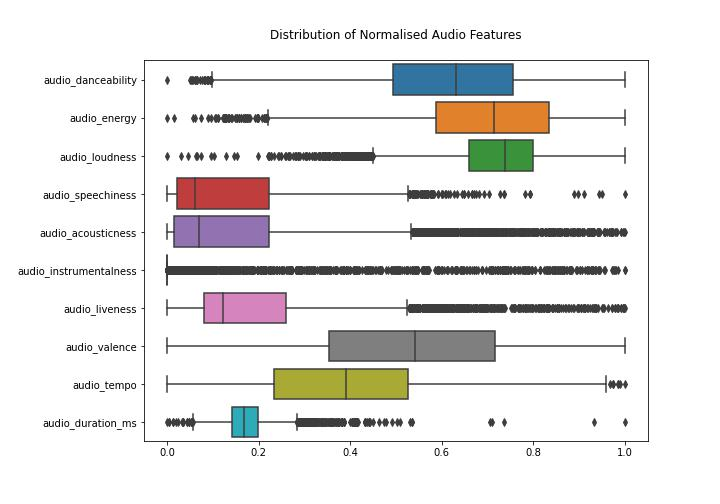

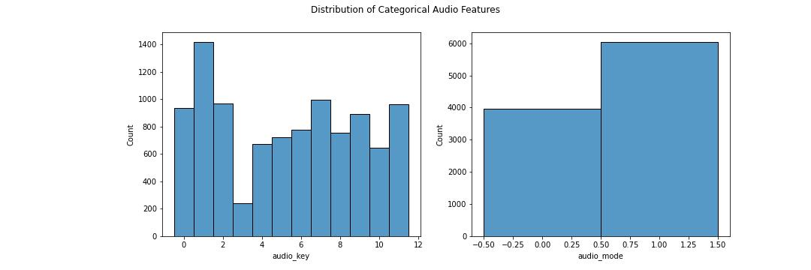

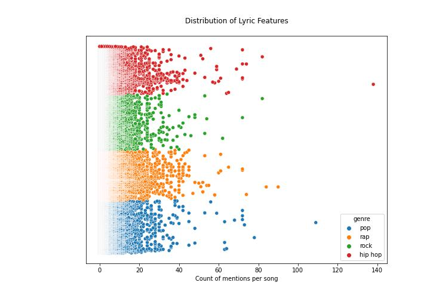

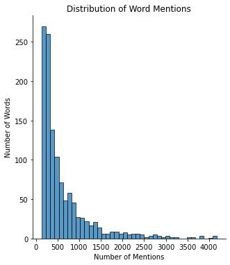

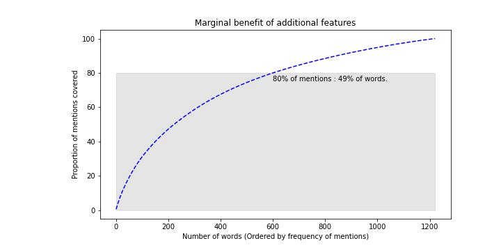

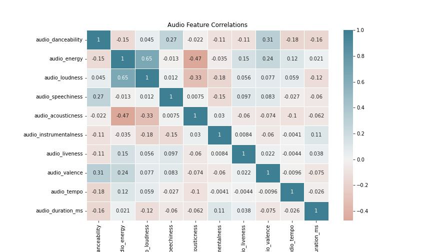

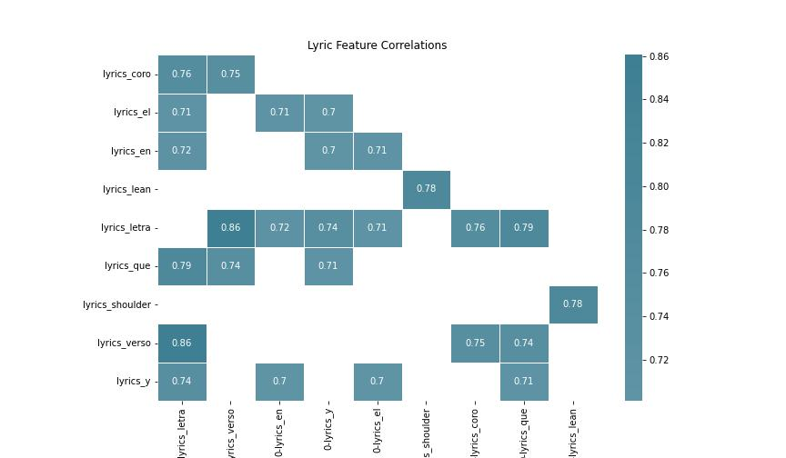

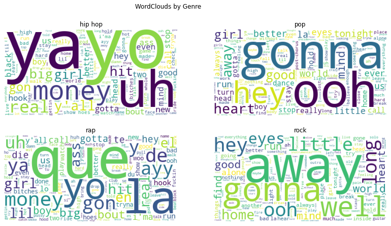

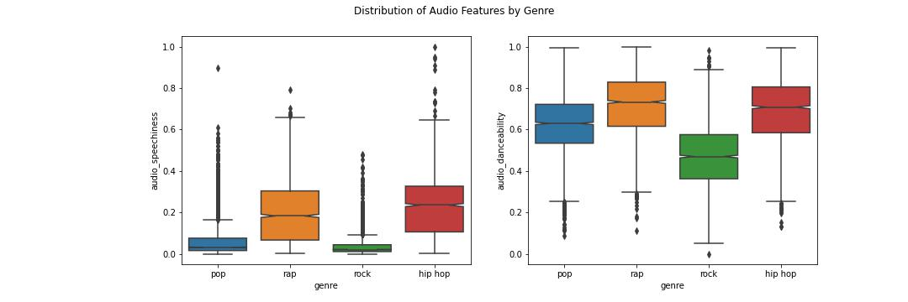

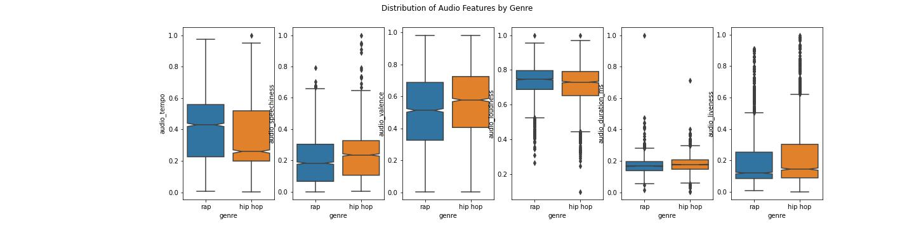

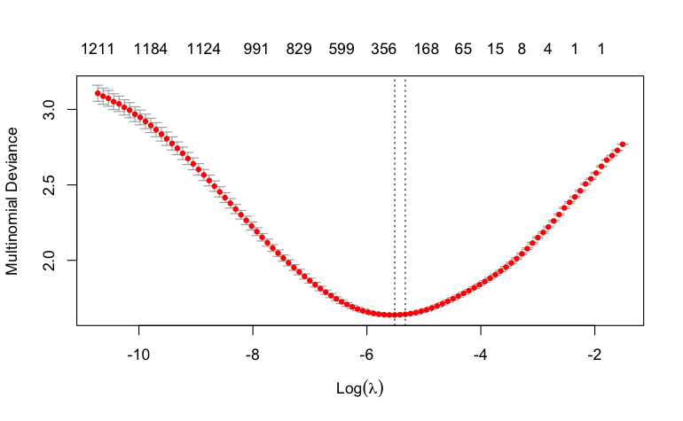

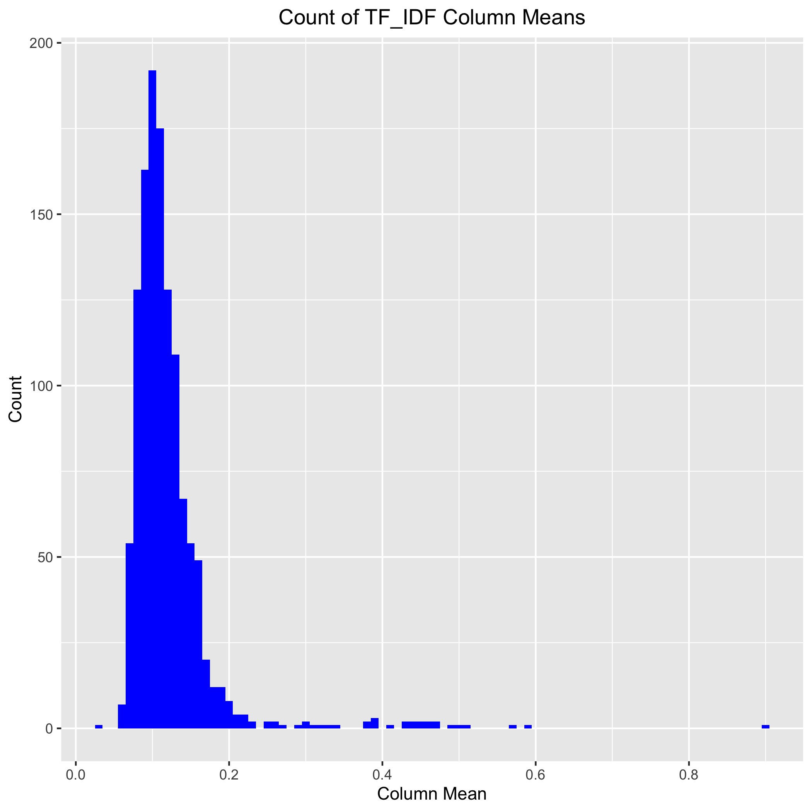


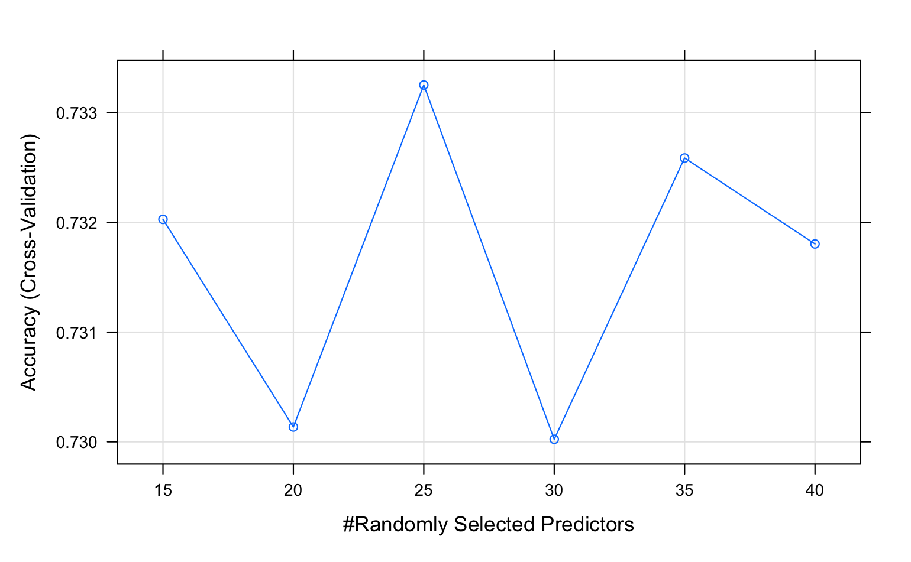

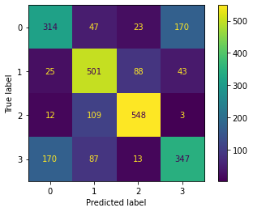

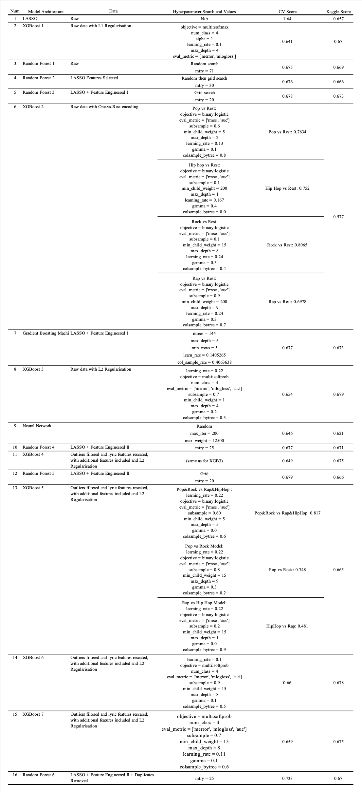
